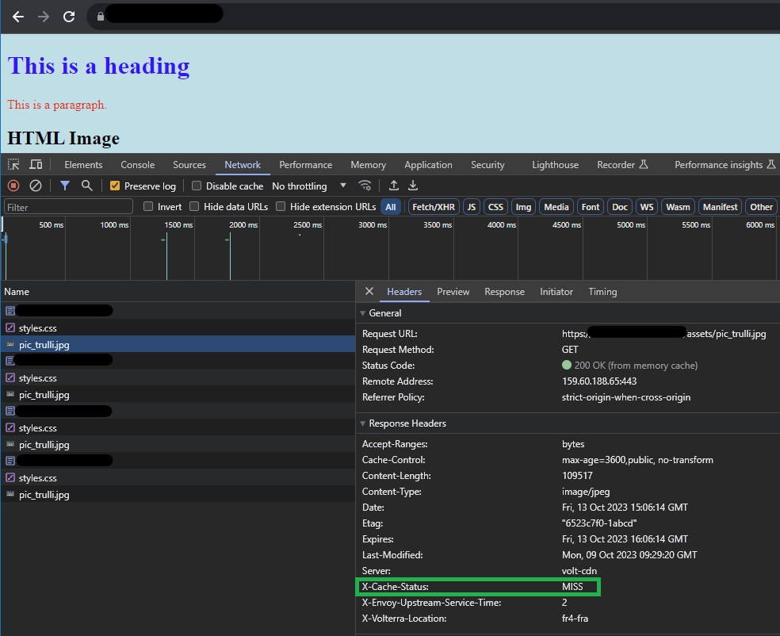
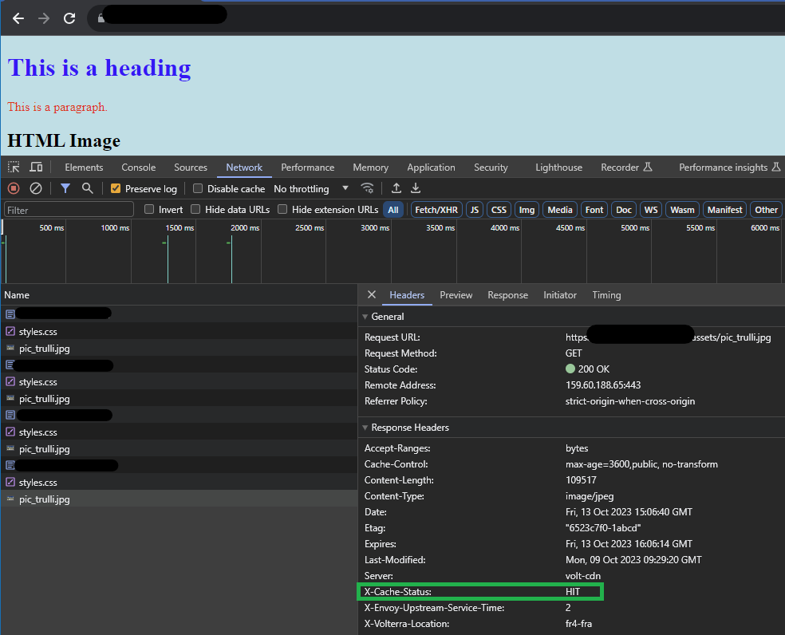

# F5 Distributed Cloud CDN Service Chaining

The F5 XC CDN works like Matryoshka dolls (aka stacking dolls). The CDN would be to outer shell, the WAAP & HTTP Loadbalancer the next layer and inside, hidden & protected, stay the origion servers.

The traffic flow would then look like this:

## Step-by-step configuration guide

### Prerequisites

* DNS Delegation must be properly setup. This usually requires some config with your DNS provider.

### Step 1: Configure HTTP Loadbalancer & WAAP Policy

1. Navigate to the Web App & API Protection tile on the home screen.

2. Click on + Add HTTP Load Balancer and configure: 
  * Name
  * A domain (this is not the domain you will use for publishing. I choose protected.mydomain.com)
  * The Load Balancer Type to be HTTP with Automatic Certificate
  * HTTP to HTTPS Redirection
  * An Origin Pool 
  * Add or create & add a WAF

3. Try to access your site from the domain you used above. Should work. Otherwise... fix it.

### Step 2: Configure CDN

1. Navigate to the Content Delivery Network tile on the home screen. See above, Step 2.1.

2. Click on + Add Distribution and configure:
  * Name
  * A domain (this is the domain you will use for publishing. I choose www.mydomain.com)
  * HTTP to HTTPS Redirection
  * A CDN Origin Pool. Add the domain you used for the Load Balancer created above in Step 2.2.

3. Try to access your site from the domain you used above. Should work. Otherwise... fix it.

### Testing WAAP

For testing the WAAP functionality, you could append a simple script tag as a query string and check that it get's blocked

### Testing CDN

When accessing the site for the first time, the CDN should be empty and the relevant HTTP header should show a miss.

After 2-3 refreshes (Ctrl+Shift+R) this should change to a cache hit.

### Remarks